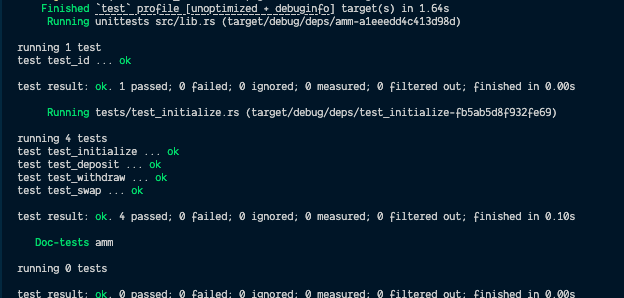

# AMM

An Anchor-based Automated Market Maker (AMM) program on Solana. Implements a constant-product curve (`x * y = k`) liquidity pool where users can initialize a pool, deposit liquidity to receive LP tokens, withdraw liquidity by burning LP tokens, and swap between two SPL tokens.

## Program ID

`Ab1DCZn8ngv3vcbmPmNLukspTfngXTCiMiAFcvtZrK19`

## Instructions

| Instruction | Description |
|-------------|-------------|
| `initialize` | Creates a new AMM pool with two token mints, a fee rate, and an optional authority; mints the LP token mint |
| `deposit` | User deposits token X and token Y into the pool vaults and receives LP tokens proportional to their share |
| `withdraw` | User burns LP tokens and receives token X and token Y back from the pool vaults |
| `swap` | User swaps token X for token Y (or vice versa) using the constant-product formula, subject to the pool fee |

## State

**`Config`** account stores:
- `seed` — unique seed used to derive the pool config PDA
- `authority` — optional admin authority for the pool
- `mint_x` — public key of token X mint
- `mint_y` — public key of token Y mint
- `fee` — swap fee in basis points
- `locked` — whether the pool is currently locked
- `config_bump` — bump for the config PDA
- `lp_bump` — bump for the LP mint PDA

## Architecture

The pool uses two vault token accounts (one for each mint) owned by the config PDA. LP tokens are minted to liquidity providers on deposit and burned on withdrawal. Swap amounts are calculated using the `constant-product-curve` crate to maintain the `x * y = k` invariant.

## Getting Started

```bash
# Install dependencies
npm install

# Build the program
anchor build

# Run tests
anchor test
```

## Tests



## Prerequisites

- [Rust](https://www.rust-lang.org/tools/install)
- [Solana CLI](https://docs.solana.com/cli/install-solana-cli-tools)
- [Anchor CLI](https://www.anchor-lang.com/docs/installation)
