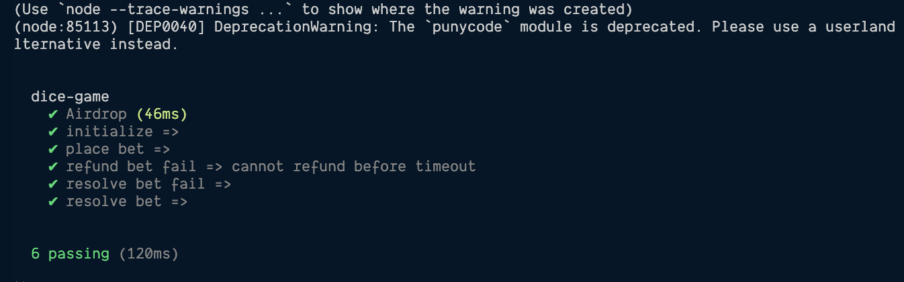

# Anchor Dice Game

A provably fair on-chain dice game built with [Anchor](https://www.anchor-lang.com/) on Solana. The game uses a **commit–reveal + instruction introspection** pattern to guarantee that the house cannot manipulate the outcome after a bet is placed.

---

## How It Works

### Commit–Reveal Scheme

1. **Before the bet** — the house generates a random secret (`preimage`) and computes a SHA-256 commitment: `commitment = sha256(preimage)`.
2. **Place Bet** — the player submits their guess roll, bet amount, and the house's commitment. The commitment is stored on-chain inside the `Bet` account so neither party can change it.
3. **Reveal** — to resolve the bet the house must submit a `reveal` instruction containing the original `preimage` in the **same transaction**, immediately before the `resolve_bet` instruction.
4. **Resolve** — `resolve_bet` uses **instruction introspection** to read the `reveal` instruction that appears at index `current_index - 1` in the same transaction. It:
   - Hashes the supplied preimage and asserts it matches the on-chain commitment.
   - Verifies the house signed the reveal instruction.
   - Derives the dice roll deterministically from the hash.
   - Pays out winnings or keeps the funds.

Because the commitment is locked on-chain before the outcome is known, the house cannot cherry-pick a preimage after seeing the player's guess.

---

## Instruction Introspection

Instruction introspection is the core security mechanism used in `resolve_bet`. It relies on Solana's **Instructions Sysvar** (`SYSVAR_INSTRUCTIONS_PUBKEY`) which exposes every instruction in the current transaction at runtime.

### Key sysvar helpers used

| Helper | Purpose |
|---|---|
| `load_current_index_checked` | Returns the index of the currently-executing instruction |
| `load_instruction_at_checked` | Loads a specific instruction by index from the sysvar |

### What `resolve_bet` does step by step

```
Transaction:  [ reveal(preimage)  |  resolve_bet() ]
                     index 0             index 1
                                    ↑ current_index
```

1. Read `current_index` → `1`.
2. Load instruction at `current_index - 1` → the `reveal` instruction.
3. Deserialize `RevealData` from the instruction data (skipping the 8-byte Anchor discriminator).
4. Confirm the house public key is a signer on that instruction (`house_is_signer`).
5. Hash the preimage and compare it against `bet.commitment`.
6. Derive the roll: `roll = (lower_u128.wrapping_add(upper_u128)) % 100 + 1`.
7. If `bet.guess_roll > roll` → player wins; transfer payout from vault to player.

If the `reveal` instruction is missing, uses the wrong preimage, or is not signed by the house, the transaction fails.

### Why this is secure

- The `reveal` and `resolve_bet` instructions **must be in the same atomic transaction** — there is no window for the house to observe the roll before deciding whether to reveal.
- The commitment stored in the `Bet` account is immutable after `place_bet`, so the house cannot swap the preimage.
- Verifying `house_is_signer` on the reveal instruction prevents a third party from injecting a fake reveal.

---

## Program Instructions

| Instruction | Signer | Description |
|---|---|---|
| `initialize` | House | Creates the vault PDA and deposits initial liquidity |
| `place_bet` | Player | Creates a `Bet` account, records commitment, deposits wager |
| `reveal` | House | No-op instruction; carries the `preimage` payload in the same tx as `resolve_bet` |
| `resolve_bet` | House | Reads the preceding `reveal` via introspection, verifies commitment, settles the bet |
| `refund_bet` | Player | Refunds the wager to the player after a timeout if the house never revealed |

---

## Accounts

### `Bet` PDA

Seeds: `["bet", vault, player, seed_le_bytes]`

| Field | Type | Description |
|---|---|---|
| `player` | `Pubkey` | Player's wallet |
| `seed` | `u128` | Random seed chosen by the player, used in PDA derivation |
| `slot` | `u64` | Slot the bet was placed (used for refund timeout) |
| `amount` | `u64` | Wager in lamports |
| `guess_roll` | `u8` | Player's chosen threshold (win if `guess_roll > roll`) |
| `bump` | `u8` | PDA bump |
| `commitment` | `[u8; 32]` | SHA-256 hash of the house's preimage |

### `Vault` PDA

Seeds: `["vault", house]`

Holds the house liquidity. Funds flow in on `place_bet` and out (to player or house) on `resolve_bet` / `refund_bet`.

---

## Game Rules

- **Roll range**: 1 – 100 (derived deterministically from the SHA-256 preimage hash).
- **Win condition**: `guess_roll > roll` (player picks a threshold; higher threshold = higher win probability but lower payout).
- **Payout formula**:

$$\text{payout} = \frac{\text{amount} \times (10000 - \text{HOUSE\_EDGE\_BP})}{\text{guess\_roll} - 1} \div 100$$

- **House edge**: `HOUSE_EDGE_BASIS_POINTS = 150` (1.5 %).
- **Minimum bet**: `10_000_000` lamports (0.01 SOL).
- **Valid guess roll**: 2 – 99.

---

## Project Structure

```
programs/anchor-dice-game/src/
├── lib.rs               # Program entry-points
├── constants.rs         # House edge, min bet, roll bounds
├── error.rs             # Custom error codes
├── state.rs             # Bet account definition
└── instructions/
    ├── initialize.rs    # Vault initialisation
    ├── place_bet.rs     # Bet creation & deposit
    ├── reveal.rs        # Reveal instruction (carries preimage)
    ├── resolve_bet.rs   # Instruction introspection + settlement
    └── refund_bet.rs    # Timeout refund
tests/
└── anchor-dice-game.ts  # Integration tests (localnet)
```

---

## Running Tests


---

## Dependencies

- [anchor-lang](https://crates.io/crates/anchor-lang)
- [solana-instructions-sysvar](https://crates.io/crates/solana-instructions-sysvar)
- [solana-sha256-hasher](https://crates.io/crates/solana-sha256-hasher)
- [solana-sdk-ids](https://crates.io/crates/solana-sdk-ids)
