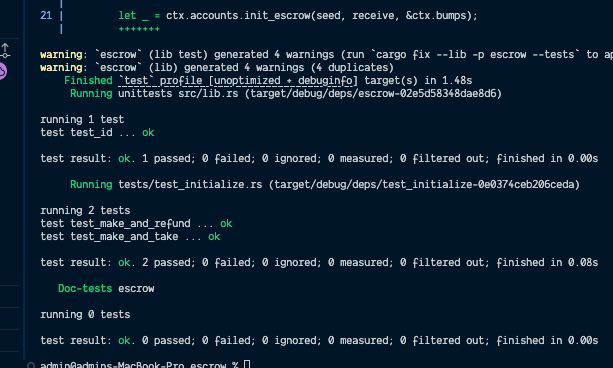

# Escrow

An Anchor-based token escrow program on Solana. A maker deposits SPL tokens into a vault and specifies the token and amount they want in return. A taker can fulfill the trade, or the maker can reclaim their deposit at any time.

## Program ID

`4oZLsGWNGVN6RDgSeuhmxVr6BJiSWSv9aPviSAZpXbVV`

## Instructions

| Instruction | Description |
|-------------|-------------|
| `make` | Maker initializes the escrow, deposits token A, and sets the amount of token B they want in return |
| `take` | Taker sends token B to the maker and receives token A from the vault; vault is closed |
| `refund` | Maker cancels the escrow, reclaims deposited token A, and closes the vault |

## State

**`Escrow`** account stores:
- `seed` — unique seed used to derive the escrow PDA
- `maker` — public key of the account that created the escrow
- `mint_a` — the token the maker deposited
- `mint_b` — the token the maker wants in return
- `receive` — the amount of token B expected
- `bump` — PDA bump

## Getting Started

```bash
# Install dependencies
npm install

# Build the program
anchor build

# Run tests
anchor test
```

## Tests



## Prerequisites

- [Rust](https://www.rust-lang.org/tools/install)
- [Solana CLI](https://docs.solana.com/cli/install-solana-cli-tools)
- [Anchor CLI](https://www.anchor-lang.com/docs/installation)
