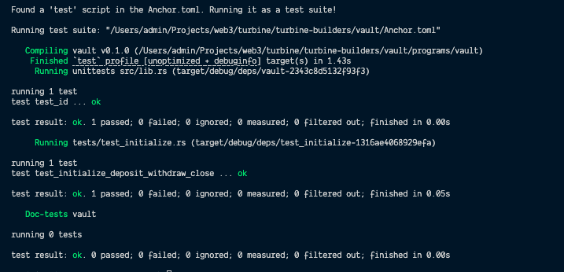

# Vault

An Anchor-based SOL vault program on Solana. Users can initialize a personal vault, deposit and withdraw SOL, and close the vault to reclaim all funds.

## Program ID

`qCZiCP89A998c88AJ1xNAYSZWJ8ZdcRygp599MYC8CU`

## Instructions

| Instruction | Description |
|-------------|-------------|
| `initialize` | Creates a new vault and vault state PDA for the user |
| `deposit` | Deposits a specified amount of SOL (lamports) into the vault |
| `withdraw` | Withdraws a specified amount of SOL (lamports) from the vault |
| `close` | Closes the vault and returns all remaining SOL to the user |

## State

**`VaultState`** account stores:
- `vault_bump` — bump for the vault PDA
- `state_bump` — bump for the vault state PDA

## Getting Started

```bash
# Install dependencies
npm install

# Build the program
anchor build

# Run tests
anchor test
```

## Tests



## Prerequisites

- [Rust](https://www.rust-lang.org/tools/install)
- [Solana CLI](https://docs.solana.com/cli/install-solana-cli-tools)
- [Anchor CLI](https://www.anchor-lang.com/docs/installation)
